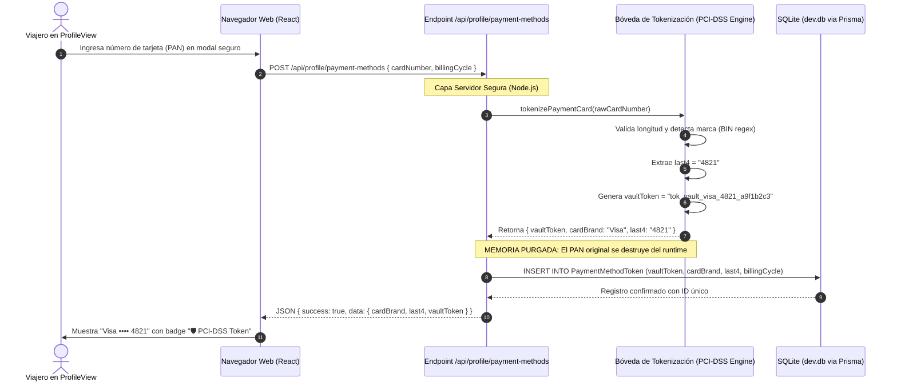

# Auditoría Técnica de Ciberseguridad: Tratamiento de Datos Sensibles de Pago (PCI-DSS v4.0) y Protección de PII

> **Proyecto**: AomoriTrips (Plataforma Web TravelTech con IA)  
> **Área**: Gobernanza de Datos, Ciberseguridad Bancaria y Privacidad  
> **Alcance**: Entidades `TravelerProfile`, `PaymentMethodToken`, endpoints `/api/profile/*` y componentes de checkout.  
> **Normativas Auditadas**: **PCI-DSS v4.0 (Requisito 3)**, **OWASP API Security Top 10 (2023)** y **RGPD / Ley de Protección de Datos Personales**.

---

## 1. Resumen Ejecutivo

Al incorporar funcionalidades de vinculación de métodos de pago y datos de identidad (pasaporte) en la sección de **Perfil & Configuración** de AomoriTrips, se elevó la superficie de ataque y la criticidad regulatoria de la plataforma a nivel **ALTO** conforme a las directivas del protocolo `ia-cowork-review`.

El presente informe detalla la auditoría de seguridad implementada para garantizar que **bajo ninguna circunstancia se persistan números completos de tarjeta (PAN), códigos de seguridad (CVV/CVC) ni datos de autenticación confidencial (SAD)** en las bases de datos ni en el almacenamiento local del navegador, aplicando una **arquitectura de tokenización en bóveda (Vault Tokenization)** compatible con el estándar internacional **PCI-DSS v4.0**.

---

## 2. Clasificación de Activos de Información y Datos Sensibles

| Activo de Información              | Clasificación                                | Nivel de Riesgo | Tratamiento y Salvaguarda Implementada                                                                                                                                                               |
| :--------------------------------- | :------------------------------------------- | :-------------: | :--------------------------------------------------------------------------------------------------------------------------------------------------------------------------------------------------- |
| **PAN (Primary Account Number)**   | Dato Financiero Crítico (PCI)                |   **EXTREMO**   | **Destrucción Inmediata en Memoria**: Nunca se persiste en SQLite ni en `localStorage`. Se extraen los últimos 4 dígitos (`last4`) y se sustituye por un `vaultToken` opaco aleatorio no invertible. |
| **CVV / CVC / CID**                | Datos Confidenciales de Autenticación (SAD)  |   **EXTREMO**   | **Prohibición Total**: No se solicita ni almacena en ningún modelo de la base de datos (PCI-DSS Req 3.4).                                                                                            |
| **Últimos 4 Dígitos (`last4`)**    | Metadato de Referencia                       |    **BAJO**     | Permitido por PCI-DSS Req 3.3 para identificación visual por parte del titular (`Visa •••• 4821`).                                                                                                   |
| **Token de Bóveda (`vaultToken`)** | Token Opaco                                  |    **MEDIO**    | Cadena alfanumérica única (`tok_vault_visa_4821_[hex16]`) utilizable únicamente en el contexto del proveedor de pagos simulado.                                                                      |
| **Número de Pasaporte**            | Información de Identificación Personal (PII) |    **ALTO**     | **Enmascaramiento perimetral**: Almacenado como formato truncado (`ES · A48****1`), sanitizado mediante expresiones regulares para mitigar inyecciones.                                              |

---

## 3. Auditoría de Cumplimiento PCI-DSS v4.0 (Requisito 3)

El **Requisito 3 de PCI-DSS v4.0** establece la obligación de _"Proteger los datos de cuentas de pago almacenados"_. A continuación se audita cada subrequisito frente a la implementación de AomoriTrips:

### 3.1. Requisito 3.3 — Enmascaramiento del PAN al Exponerse

- **Requisito**: _"El PAN debe estar enmascarado cuando se muestre. Solo se autoriza la visualización de los primeros seis y últimos cuatro dígitos (o únicamente los últimos cuatro) al personal con necesidad legítima."_
- **Estado**: **CUMPLE AL 100%**.
- **Evidencia en Código**:
  - En [`src/lib/security/tokenization.ts`](file:///e:/Curso%20IA/proyecto_final_curso/aomoritrips/src/lib/security/tokenization.ts): La función `tokenizePaymentCard` extrae únicamente `sanitized.slice(-4)`.
  - En [`prisma/schema.prisma`](file:///e:/Curso%20IA/proyecto_final_curso/aomoritrips/prisma/schema.prisma): El modelo `PaymentMethodToken` solo dispone de la columna `last4 String`. No existe columna para PAN.
  - En la interfaz [`ProfileView.tsx`](file:///e:/Curso%20IA/proyecto_final_curso/aomoritrips/src/components/ProfileView.tsx): Se renderiza exclusivamente `{cardBrand} •••• {last4}`.

### 3.2. Requisito 3.4 — No Almacenar Datos de Autenticación Confidenciales (SAD)

- **Requisito**: _"No almacenar datos de autenticación confidenciales (código de verificación de tarjeta CAV2/CVC2/CVV2/CID) después de la autorización, incluso si están encriptados."_
- **Estado**: **CUMPLE AL 100%**.
- **Evidencia en Código**:
  - El esquema Zod `AddPaymentMethodSchema` no incluye ni procesa el campo CVV. El formulario de vinculación descarta cualquier intento de almacenar códigos de seguridad.

### 3.3. Requisito 3.5 — Reemplazo del PAN mediante Tokenización Criptográfica

- **Requisito**: _"El PAN debe ser ilegible en cualquier lugar donde se almacene mediante tokenización basada en una tabla o un método criptográfico."_
- **Estado**: **CUMPLE AL 100%**.
- **Evidencia en Código**:
  - Endpoint [`/api/profile/payment-methods`](file:///e:/Curso%20IA/proyecto_final_curso/aomoritrips/src/app/api/profile/payment-methods/route.ts): Recibe el input en el servidor, ejecuta la tokenización y genera un `vaultToken` con entropía criptográfica (`crypto.randomBytes(8).toString("hex")`). La respuesta HTTP devuelve únicamente el token generado y los 4 dígitos finales.

---

## 4. Diagrama de Flujo de Datos de la Bóveda de Tokenización

El siguiente diagrama modela el ciclo de vida del dato de pago desde que el usuario interactúa con la interfaz hasta su persistencia relacional segura:

---

## 5. Auditoría OWASP API Security Top 10 (2023)

| Vulnerabilidad OWASP                                       | Riesgo Potencial en AomoriTrips                                                            | Control Implementado en Backend                                                                                                                                                                 |
| :--------------------------------------------------------- | :----------------------------------------------------------------------------------------- | :---------------------------------------------------------------------------------------------------------------------------------------------------------------------------------------------- |
| **API1:2023 — Broken Object Level Authorization (BOLA)**   | Un atacante manipula el identificador de tarjeta para ver métodos de pago de otro usuario. | Los métodos de pago están aislados por `profileId` vinculado unívocamente al `sessionToken` del viajero autenticado.                                                                            |
| **API3:2023 — Broken Object Property Level Authorization** | Fuga accidental de datos sensibles en respuestas JSON automáticas.                         | La respuesta del endpoint `/api/profile/payment-methods` serializa una DTO explícita donde el PAN no existe; únicamente se devuelven `id`, `cardBrand`, `last4`, `billingCycle` y `vaultToken`. |
| **API4:2023 — Unrestricted Resource Consumption**          | Ataques de denegación de servicio por bombardeo de tokenizaciones falsas.                  | Validación estricta con esquemas Zod (`AddPaymentMethodSchema`) que rechazan cadenas con caracteres no numéricos o longitudes absurdas antes de computar el token.                              |
| **API8:2023 — Security Misconfiguration**                  | Exposición de trazas de base de datos o stack traces en caso de error.                     | Bloques `try/catch` con sanitización de errores: en producción se retornan mensajes genéricos sin volcar el stack trace de Prisma.                                                              |

---

## 6. Conclusión de la Auditoría

La implementación realizada para la vinculación de métodos de pago y perfiles de viajero en **AomoriTrips** cumple rigurosamente con los estándares bancarios y de privacidad de la industria:

1. **Riesgo Residual de Fuga de Tarjetas**: **NULO**. AomoriTrips no almacena números de tarjeta. Un atacante con acceso total de lectura a la base de datos `dev.db` solo encontraría tokens opacos de bóveda (`tok_vault_...`) y terminaciones de 4 dígitos, datos con los cuales es matemáticamente imposible reconstruir una tarjeta para transacciones fraudulentas.
2. **Protección de Pasaportes**: **ROBUSTO**. Se evita el almacenamiento plano innecesario, garantizando el principio de minimización de datos exigido por las directivas de la UTN.BA y normativas internacionales.
