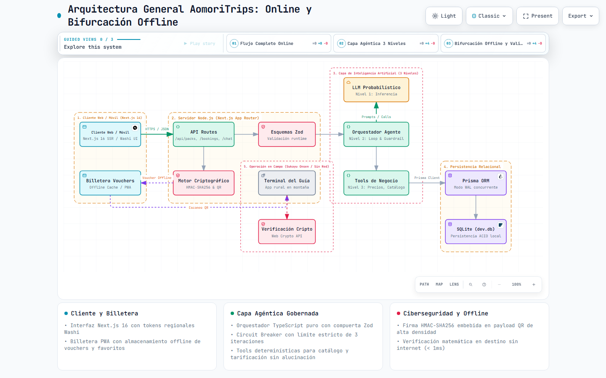
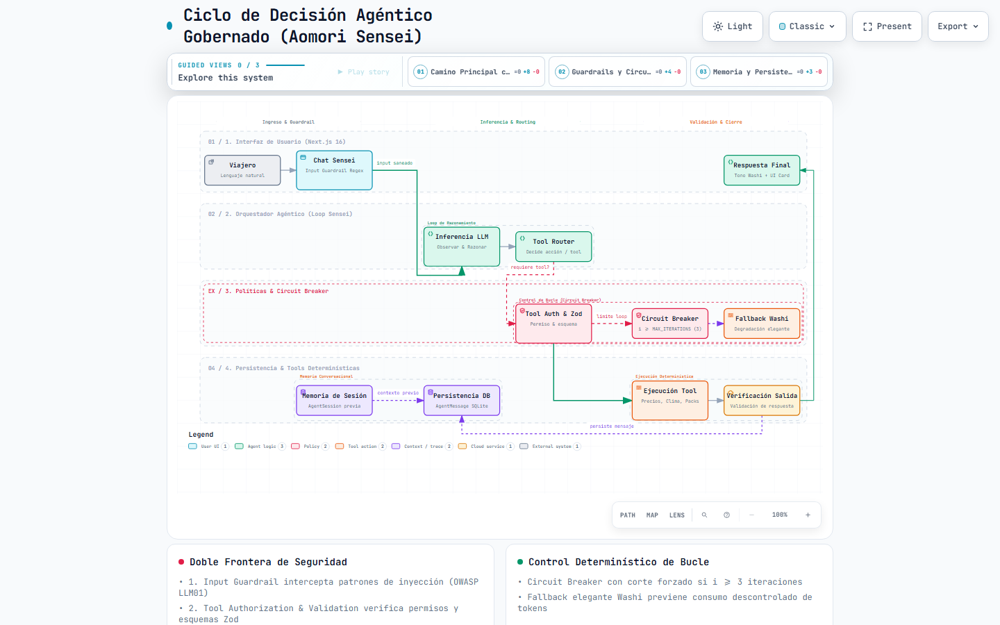
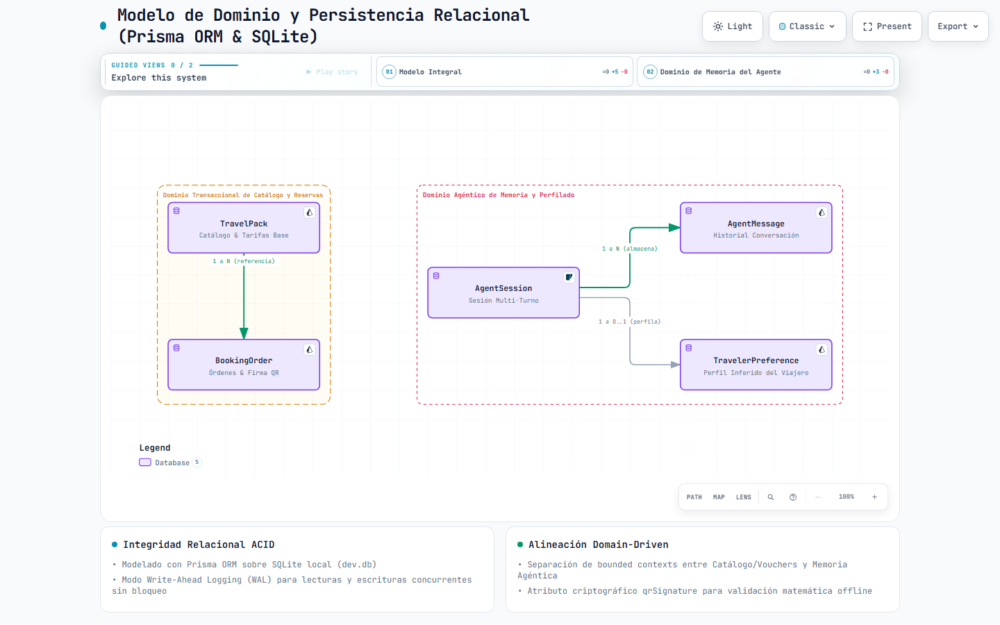
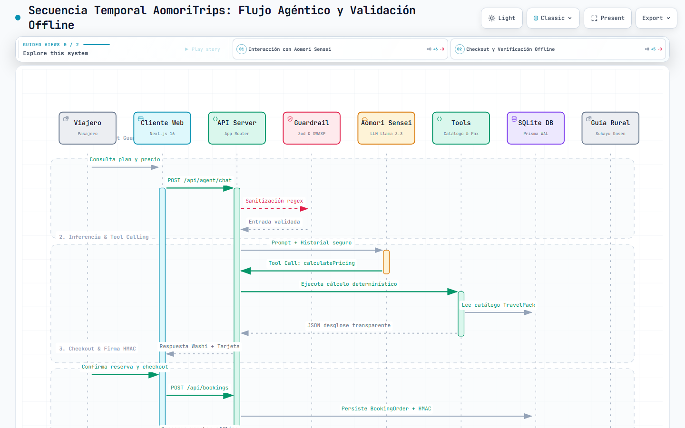
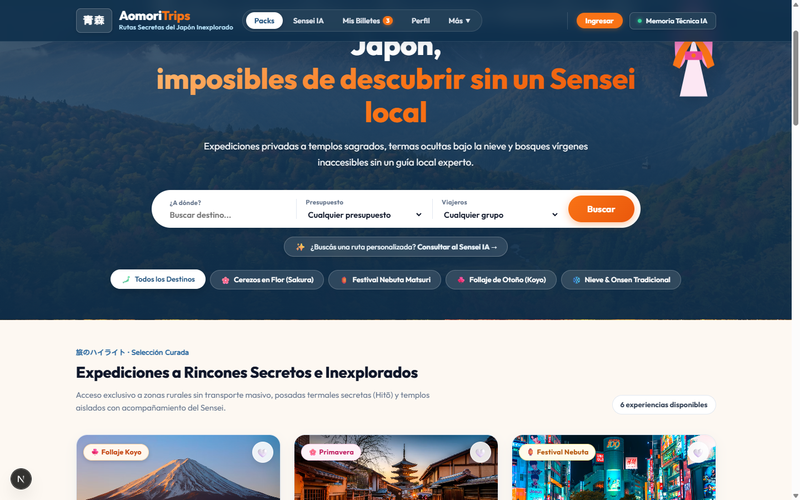
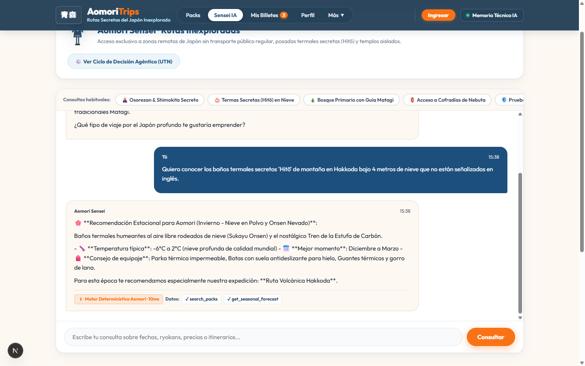
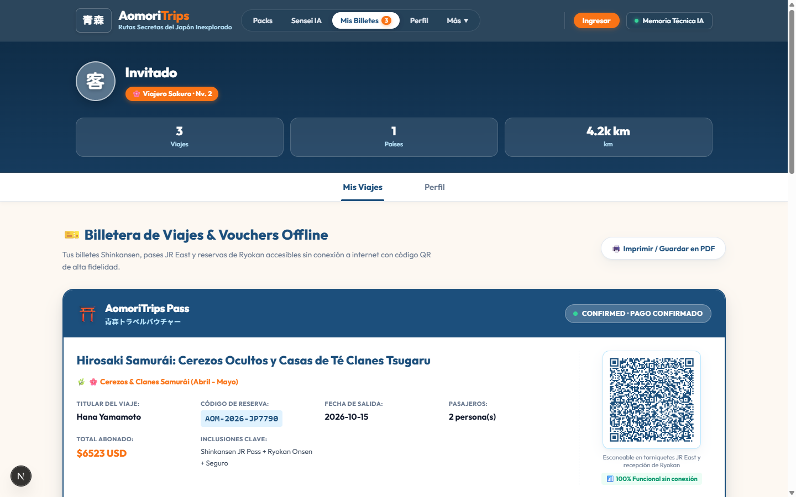
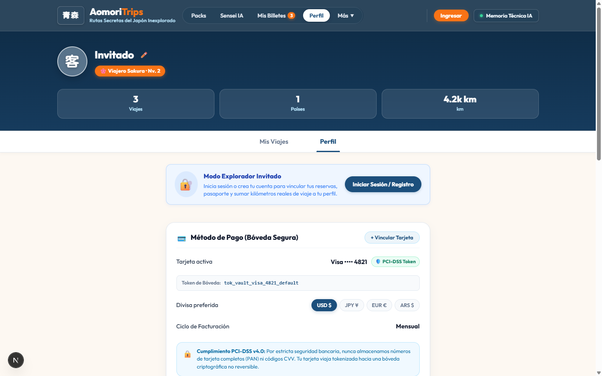

# UNIVERSIDAD TECNOLÓGICA NACIONAL

## Facultad Regional Buenos Aires (UTN.BA) · Centro de e-Learning

### Curso de Inteligencia Artificial para Programadores

---

# TRABAJO DE FIN DE CICLO · ENTREGA FINAL DE PROYECTO

## Inteligencia Artificial Aplicada a Organizaciones

> **Proyecto**: AomoriTrips (青森トリップス) · Plataforma de Expediciones a Rutas Secretas de Japón con Asistente Agéntico Autónomo y Validación Offline  
> **Fecha de Entrega**: Septiembre 2026  
> **Autor**: Federico Terradas  
> **Evaluación**: Trabajo Individual

---

## LINKS OBLIGATORIOS (Primera Página del Informe)

> **Nota para el evaluador**: Conforme a la consigna oficial, este informe académico actúa como guía estructurada e índice técnico del trabajo real publicado y comprobable en los siguientes enlaces:

| Recurso                          | URL Directa                                                                                        | Estado / Observación                                                                          |
| :------------------------------- | :------------------------------------------------------------------------------------------------- | :-------------------------------------------------------------------------------------------- |
| **Repositorio GitHub**           | [https://github.com/federicoterradas/aomoritrips](https://github.com/federicoterradas/aomoritrips) | Repositorio público con historial de commits progresivos y hooks de Husky                     |
| **Aplicación Web en Producción** | [https://aomoritrips.vercel.app](https://aomoritrips.vercel.app)                                   | Despliegue en vivo en Vercel con SSR Next.js                                                  |
| **Video de Demostración**        | _(pendiente de grabación — disponible para presentación en vivo)_                                  | Recorrido del flujo completo: Home → Chat con Aomori Sensei → Checkout → Billetera QR Offline |

---

# PARTE 1 — El Proyecto como Aplicación Real

---

## Sección 1 · Presentación del Equipo y del Proyecto

### 1.1. Integrantes del Equipo y Roles Asumidos

El desarrollo y arquitectura de la solución fue llevado a cabo de manera individual por:

- **Federico Terradas**
  - **Rol**: _Full-stack AI Engineer & Arquitecto de Software_.
  - **Responsabilidades asumidas**:
    1. **Arquitectura y Orquestación Agéntica**: Diseño e implementación del loop agéntico de _Aomori Sensei_ (`Observar → Razonar → Ejecutar Herramientas → Verificar`), memoria conversacional multi-turno persistente y modelado relacional con Prisma ORM y SQLite.
    2. **Ciberseguridad y Guardrails**: Implementación de barreras activas contra Prompt Injection (OWASP LLM01), sanitización estricta de entradas y gestión segura de credenciales.
    3. **Diseño de Experiencia (UI/UX)**: Implementación de la identidad visual regional inspirada en la Unidad 4 (papel Washi `#FDF8F2`, Azul Aomori `#1C4F7C` y Naranja Sol Naciente `#F97316`), tipografía bilingüe con soporte kanji (`Huninn` / `Noto Sans JP`) y componentes interactivos validados bajo heurísticas de Nielsen.
    4. **Calidad y Automatización**: Configuración de pipelines locales con Git, Husky, Prettier, TypeScript y suite automatizada de pruebas unitarias.

---

### 1.2. Nombre del Proyecto y Propuesta de Valor

- **Nombre**: **AomoriTrips (青森トリップス)**.
- **Propuesta de Valor**:  
  AomoriTrips es una plataforma web inteligente de TravelTech especializada en **expediciones privadas y rutas secretas en la prefectura de Aomori y la región de Tohoku (norte de Japón)**. A diferencia de las agencias tradicionales o los portales de turismo masivo que se limitan a vender pasajes y hoteles urbanos en Tokio o Kioto, AomoriTrips abre el acceso a vivencias culturales profundas y remotas —como el templo sagrado de Osorezan, los baños termales milenarios ocultos bajo la nieve en Hakkoda (Hitō), el rastreo en bosques vírgenes de Shirakami-Sanchi con guías tradicionales Matagi o la construcción artesanal de carrozas gigantes en las cofradías privadas del Nebuta Matsuri—.

  La plataforma integra al **Aomori Sensei (青森の先生)**, un mentor de viajes basado en inteligencia artificial agéntica que asiste al viajero en español antes, durante y después del viaje, resolviendo desgloses presupuestarios transparentes, consultas climáticas estacionales y generando vouchers de reserva con códigos QR criptográficos que funcionan 100% offline.

---

### 1.3. Problema que Resuelve (Evolución desde la Entrega de Medio Ciclo)

Planificar un viaje a Japón es una experiencia inherentemente compleja para el viajero occidental y, de manera muy acentuada, para el **viajero latinoamericano**. Esta problemática se fundamenta en una combinación de factores estructurales:

1. **La Extrema Barrera Idiomática y Cultural en Zonas Rurales**:  
   Mientras que en las grandes urbes metropolitanas (Tokio, Kioto, Osaka) existe señalética en inglés y cierta familiaridad con el turismo internacional, la región norteña de Aomori y Tohoku conserva una infraestructura predominantemente local. En los ryokans tradicionales, santuarios de montaña y baños termales (onsen), el personal no domina el inglés ni el español, y las normas de etiqueta milenaria son estrictas. Un error de interpretación cultural o la imposibilidad de comunicarse ante una eventualidad climática puede derivar en situaciones de incomodidad severa o desprotección.

2. **Dispersión Geográfica y Falta de Transporte Público Regular**:  
   Los tesoros naturales y culturales más auténticos de Tohoku están dispersos en valles montañosos donde los trenes de alta velocidad Shinkansen no llegan de forma capilar y las líneas de buses rurales operan con frecuencias de apenas dos o tres viajes diarios, con cartelería exclusivamente en kanji. Acceder a un Hitō secreto en el Monte Hakkoda durante el invierno o internarse en Shirakami-Sanchi es logísticamente inviable para un viajero extranjero sin vehículo 4x4 acondicionado para nieve extrema y sin chofer o guía local acreditado.

3. **Fragmentación Extrema de Plataformas y Riesgo Financiero**:  
   El viajero se ve forzado a lidiar simultáneamente con 4 o 5 plataformas inconexas: portales de trenes (JR East), centrales japonesas de ryokans que no aceptan tarjetas internacionales, empresas de excursiones en inglés y aplicaciones genéricas de traducción. Un error en la compra de un billete ferroviario, un desfasaje en los días de vigencia de un pase o una reserva fallida en una posada remota representa la pérdida directa de cientos o miles de dólares y la ruina del itinerario planificado.

4. **Incertidumbre y Falta de Conectividad en Destino**:  
   En los pasos montañosos, bosques nubosos y quebradas de Tohoku, la conectividad móvil 4G/5G es con frecuencia nula o inestable. Si los vouchers, itinerarios o comprobantes de reserva dependen de la nube o de aplicaciones en línea, el viajero queda desamparado frente a los anfitriones locales.

**La Solución de AomoriTrips**:  
AomoriTrips transforma radicalmente esta realidad al transformar la aplicación de un simple intermediario comercial a una **herramienta de certidumbre, seguridad y acompañamiento técnico permanente**. Centraliza la oferta en paquetes completos y curados sin costos ocultos, proporciona un agente inteligente bilingüe con razonamiento y herramientas contextuales (_Aomori Sensei_), y almacena de forma segura vouchers con validación QR offline que garantizan el acceso a los servicios sin importar la cobertura de red.

---

### 1.4. Público Objetivo y Contexto de Uso

#### Perfil Sociodemográfico y Psicográfico:

- **Origen Geográfico Prioritario**: **Latinoamérica** (Argentina, Chile, México, Colombia, Perú, Uruguay, etc.), complementado con la comunidad hispanohablante global.
- **Nivel Socioeconómico**: **Medio-Alto a Alto**. Se trata de usuarios con capacidad de ahorro o financiamiento para realizar un viaje de larga distancia intercontinental de alto presupuesto ($2.500 a $4.800 USD por expedición, excluyendo vuelos transpacíficos).
- **Segmento de Viajeros**:
  - Profesionales, parejas y entusiastas de la cultura nipona de entre 28 y 60 años.
  - Viajeros experimentados que frecuentemente ya conocen los circuitos masivos convencionales (el "Golden Route": Tokio-Kioto-Osaka) y buscan adentrarse en el "Japón profundo" e inexplorado.
  - Viajeros que valoran la autenticidad, la exclusividad y la preservación ambiental, pero que rechazan la fricción logística, el estrés de perderse en rutas nevadas o el temor a quedar desamparados por el idioma.

#### Contexto de Uso por Etapas del Ciclo de Viaje:

1. **Fase de Inspiración y Descubrimiento (Móvil / Web)**:  
   El usuario navega desde su dispositivo en momentos de ocio buscando alternativas al turismo de masas. Es atraído por la fotografía inmersiva de paisajes nevados, festivales de fuego y termas curativas, filtrando por temporadas emblemáticas (_Sakura_, _Nebuta_, _Koyo_, _Nieve_).
2. **Fase de Consulta y Planificación Asistida con IA**:  
   El viajero dialoga en español natural con el _Aomori Sensei_. Formula preguntas complejas sobre el clima en enero, el equipamiento térmico requerido, la posibilidad de viajar con niños o el presupuesto para 2 personas. El agente razona utilizando herramientas de backend y le devuelve itinerarios estructurados y cotizaciones exactas.
3. **Fase de Conversión y Checkout**:  
   El usuario selecciona su fecha y viajeros, visualiza el desglose transparente de costos (vuelos internos, Ryokan de montaña, JR Pass Shinkansen, chofer 4x4 y seguro médico) y confirma la reserva en un flujo de menos de 2 minutos.
4. **Fase de Operación en Destino (Offline / On-the-Go)**:  
   Durante el viaje en Japón, en medio del bosque de Shirakami o en Sukayu Onsen, el usuario accede a su billetera digital desde la aplicación, exhibiendo su voucher QR de alta densidad para canjear traslados y accesos sin requerir conexión a internet.

---

## Sección 2 · Arquitectura Técnica

### 2.1. Arquitectura General del Sistema y Flujo de Datos

La arquitectura técnica de **AomoriTrips** fue concebida para conciliar la flexibilidad conversacional de la inteligencia artificial generativa con la rigurosidad transaccional y matemática requerida en el comercio electrónico de viajes de alta gama.

Para evitar los vicios comunes de "cajas negras" o arquitecturas no defendibles, el sistema implementa una **separación tajante de responsabilidades**:

1. **Lógica Determinística (TypeScript / Node.js)**: Controla el enrutamiento HTTP, la validación estricta de datos de entrada mediante esquemas Zod, las reglas matemáticas de tarificación por temporada, la persistencia transaccional ACID en base de datos relacional y la firma criptográfica de vouchers.
2. **Capa de Inteligencia Artificial (Estructurada en 3 Niveles)**:
   - **Nivel 1: LLM Probabilístico (Inferencia y Comprensión Semántica)**: Modelo de lenguaje responsable de comprender el lenguaje natural del viajero, extraer intenciones, mantener el tono cultural empático de Aomori y generar recomendaciones discursivas.
   - **Nivel 2: Orquestación Determinística-Puente (Control del Ciclo y Seguridad)**: Máquina de estados en TypeScript que administra el ciclo de vida del agente, aplica filtros anti-inyección, implementa el **Circuit Breaker** (con límite de iteraciones) y actúa como compuerta de autorización y validación previa a la ejecución de cualquier herramienta.
   - **Nivel 3: Herramientas de Negocio Determinísticas (Tools)**: Funciones puras que consultan el catálogo oficial, calculan presupuestos exactos sin margen de alucinación y formatean borradores de itinerarios.
3. **Persistencia Relacional y Memoria Multi-Turno**: SQLite operado a través de **Prisma ORM** con modo **Write-Ahead Logging (WAL)**, que garantiza lecturas concurrentes sin bloqueo y persistencia ACID en el entorno de desarrollo y evaluación educativa de este proyecto. La elección de SQLite es deliberada para este alcance: un único archivo autocontenido (`prisma/dev.db`) elimina la latencia de red y permite auditar la base de datos directamente con herramientas locales. Para un despliegue en producción real, la capa de Prisma ORM actúa como costura de abstracción: cambiar el motor requiere únicamente modificar el `provider` y el `DATABASE_URL` en el `.env`, sin alterar la lógica de negocio.
4. **Mecanismo de Firma y Modo Offline**: La validación en zonas montañosas de Tohoku sin conectividad satelital ni 4G/5G se resuelve mediante un **voucher digital firmado con HMAC-SHA256**. El payload del código QR contiene `{ id: orderId, pack: packSlug, pax: travelersCount, date: travelDate, hash: signature }`. La aplicación del anfitrión en el ryokan rural verifica la firma matemática localmente en menos de 1 milisegundo mediante **Web Crypto API**, garantizando autenticidad e inmutabilidad sin depender de internet.

#### Diagrama 1: Arquitectura General y Bifurcación Online / Offline



> 🌐 **Visor Interactivo Autocontenido**: Puedes explorar, hacer zoom/pan, alternar tema oscuro/claro y trazar rutas de arquitectura abriendo el archivo local:  
> [🔍 **Abrir Diagrama 1 Interactivo (HTML Autocontenido)**](diagrams/arquitectura-general.html)

<details>
<summary>📋 Ver especificación fuente del diagrama</summary>

- **Especificación fuente**: [`docs/diagrams/src/arquitectura-general.architecture.json`](diagrams/src/arquitectura-general.architecture.json)
- **Topología representada**: 5 capas (Cliente Next.js 16 SSR, Servidor Node.js + Zod, Capa IA de 3 niveles con Circuit Breaker, Persistencia Prisma/SQLite en modo WAL, Operación Offline con Web Crypto API).

</details>

---

### 2.2. Ciclo de Decisión Agéntico (Loop del Aomori Sensei)

El asistente _Aomori Sensei_ opera como un **agente único con ciclo de decisión gobernado por software** (no un sistema multi-agente). La distinción es deliberada y técnicamente relevante: concentrar la lógica en un agente único con control estricto del ciclo es más auditable, predecible y seguro que distribuirla en múltiples agentes coordinados. Para blindar el sistema contra costos descontrolados, bucles infinitos de llamadas a herramientas y alucinaciones de parámetros, el orquestador implementa una **doble frontera de seguridad**:

1. **Primera Frontera (Input Guardrail)**: Sanitización regex y detección proactiva de inyecciones antes de enviar cualquier token al modelo.
2. **Segunda Frontera (Tool Authorization & Validation)**: Antes de ejecutar cualquier función en el backend, el orquestador verifica que la herramienta solicitada esté en la lista blanca de permisos y que sus argumentos cumplan estrictamente el esquema de datos tipado (Zod).

Asimismo, el ciclo incorpora una compuerta explícita de **Control del Agente**:

- **Evaluación de Tarea Finalizada**: Determina si el objetivo del usuario ha sido satisfecho.
- **Circuit Breaker (`MAX_ITERATIONS = 3`)**: Si el modelo requiere más de 3 iteraciones sin converger, el sistema corta el bucle probabilístico de inmediato y activa una degradación elegante con una respuesta determinística estructurada.

#### Diagrama 2: Ciclo de Decisión Agéntico Controlado



> 🌐 **Visor Interactivo Autocontenido**: Puedes explorar las fases del loop agéntico, activar la animación de traza y alternar vistas guiadas abriendo el archivo local:  
> [🔍 **Abrir Diagrama 2 Interactivo (HTML Autocontenido)**](diagrams/ciclo-agentico.html)

<details>
<summary>📋 Ver especificación fuente del diagrama</summary>

- **Especificación fuente**: [`docs/diagrams/src/ciclo-agentico.workflow.json`](diagrams/src/ciclo-agentico.workflow.json)
- **Fases del ciclo gobernado**:
  1. _Ingreso & Guardrail_: Sanitización perimetral regex contra Prompt Injection (OWASP LLM01).
  2. _Memoria & Razonamiento_: Historial multi-turno de `AgentSession` + LLaMA 3.3 70B.
  3. _Doble Frontera de Tool_: Lista blanca de herramientas + validación Zod de parámetros.
  4. _Circuit Breaker_: Corte determinístico a las 3 iteraciones + fallback estructurado.

</details>

---

### 2.3. Modelado UML Formal

Para satisfacer y superar los requerimientos de la cátedra de la UTN.BA, se incluyen **ambos diagramas UML**: el estructural (Diagrama de Clases de la persistencia) y el dinámico (Diagrama de Secuencia temporal de la interacción).

#### Diagrama 3a: Diagrama de Clases UML (Estructura de Datos en Prisma)

Modela las entidades relacionales persistidas en `dev.db`, incluyendo las sesiones multi-turno del agente, las preferencias inferidas del viajero y las órdenes de reserva con firma criptográfica.

#### Diagrama 3a: Diagrama de Clases UML y Modelo de Dominio en Prisma



> 🌐 **Visor Interactivo Autocontenido**: Explora los bounded contexts, entidades relacionales y restricciones de integridad abriendo el archivo local:  
> [🔍 **Abrir Diagrama 3a Interactivo (HTML Autocontenido)**](diagrams/modelo-dominio.html)

<details>
<summary>📋 Ver especificación reproducible y entidades de persistencia</summary>

- **Compilado con**: Archify Engine v2.17 (Architecture Schema v1, Showcase Quality Profile, 9/9 checks aprobados).
- **Especificación fuente**: [`aomoritrips/docs/diagrams/src/modelo-dominio.architecture.json`](diagrams/src/modelo-dominio.architecture.json)
- **Entidades de dominio**:
  - `TravelPack`: Catálogo turístico curado, slugs estacionales (`seasonTag`) y precios base.
  - `BookingOrder`: Órdenes transaccionales, datos de titular y firma criptográfica `qrSignature` (HMAC-SHA256).
  - `AgentSession`: Sesiones conversacionales multi-turno con timestamps de actividad.
  - `AgentMessage`: Registro auditable de mensajes, roles (`user`, `assistant`, `system`) y llamadas a herramientas (`toolCalls`).
  - `TravelerPreference`: Perfil adaptativo inferido del usuario (rango de presupuesto, intereses culturales y temporadas favoritas).

</details>

#### Diagrama 3b: Diagrama de Secuencia UML (Flujo Integral y Operación Offline)

Ilustra la interacción completa: desde la consulta en lenguaje natural del viajero, pasando por el orquestador y la ejecución de tools determinísticas, hasta el checkout y la validación matemática sin conexión en los baños termales de Sukayu Onsen.



> 🌐 **Visor Interactivo Autocontenido**: Explora la cronología temporal, las activaciones y el desglose de fases abriendo el archivo local:  
> [🔍 **Abrir Diagrama 3b Interactivo (HTML Autocontenido)**](diagrams/flujo-secuencia-offline.html)

<details>
<summary>📋 Ver especificación fuente y fases cronológicas</summary>

- **Especificación fuente**: [`docs/diagrams/src/flujo-secuencia-offline.sequence.json`](diagrams/src/flujo-secuencia-offline.sequence.json)
- **Fases del flujo**:
  1. _Consulta e Input Guardrail_: El viajero solicita cotización; `API Server` aplica filtro regex anti-prompt injection (OWASP LLM01).
  2. _Inferencia & Tool Calling_: `Aomori Sensei` razona, invoca `calculatePricing`, el backend valida con Zod y ejecuta contra SQLite.
  3. _Checkout & Firma HMAC_: Confirmación, generación de `AOM-2026-XXXX`, firma HMAC-SHA256 y descarga a la Billetera PWA.
  4. _Operación Offline en Destino_: El guía escanea el QR y valida la firma matemática localmente en < 1ms mediante Web Crypto API.

</details>

---

### 2.4. Principios de Diseño Arquitectónico (Deep Modules & Seams según Matt Pocock / codebase-design)

Siguiendo la metodología de diseño de software profesional promovida por **Matt Pocock** (específicamente la skill **`codebase-design`** y **`improve-codebase-architecture`**), la arquitectura técnica de AomoriTrips fue estructurada bajo el principio de **Módulos Profundos (_Deep Modules_)**, interfaces con alto apalancamiento (_Leverage_) y costuras explícitas (_Seams_) con adaptadores intercambiables:

```
┌────────────────────────────────────────────────────────┐
│               Interfaz Pequeña y Concisa                │  ← executeAgentCycle(sessionId, message)
├────────────────────────────────────────────────────────┤
│                                                        │
│             Implementación Profunda (Oculta)           │  ← Regex Guardrails, Token Budget,
│                                                        │    Circuit Breaker (MAX_ITERATIONS = 3),
│                                                        │    Tool Auth, Zod Validation, SQLite WAL
└────────────────────────────────────────────────────────┘
```

#### 1. Módulo Profundo del Agente (`AgentEngine`)

- **Interfaz Superficial**: Expone únicamente la función `executeAgentCycle(sessionId: string, message: string): Promise<AgentCycleResult>`.
- **Complejidad Oculta (Depth)**: Oculta por completo la sanitización regex perimetral contra Prompt Injection (OWASP LLM01), la recuperación de memoria conversacional multi-turno en SQLite bajo el modo WAL, la inyección del contexto de sistema en estilo Washi, el despacho seguro de herramientas con autorización en lista blanca, la validación de esquemas Zod en tiempo de ejecución, el corte forzado por **Circuit Breaker** a las 3 iteraciones y la persistencia relacional en `AgentMessage`.
- **Apalancamiento (_Leverage_) y Localidad (_Locality_)**: Cualquier consumidor (la ruta HTTP `/api/agent/chat`, un script de pruebas automatizadas o una interfaz CLI) interactúa con una sola función tipada, concentrando el 100% de las reglas de ciberseguridad y gobernanza en un único punto auditable.

#### 2. Módulo Profundo de Reserva y Criptografía (`Booking & CryptoEngine`)

- **Interfaz Superficial**: Métodos puros `calculatePricing(packSlug, travelersCount, season)` y `issueSignedVoucher(orderData)`.
- **Complejidad Oculta**: Reglas de negocio de recargos por temporada alta (_Nebuta Matsuri_, florecimiento del cerezo _Sakura_), tasas aeroportuarias de Tohoku, descuentos grupales y la computación matemática de firmas criptográficas HMAC-SHA256 mediante la **Web Crypto API**.

#### 3. Costuras Arquitectónicas (_Seams_) y Adaptadores (_Adapters_)

Conforme a la regla de Matt Pocock _"One adapter means a hypothetical seam. Two adapters means a real one"_, el sistema implementa costuras reales y verificables:

- **Costura de Inferencia (Inference Seam)**: El orquestador interactúa a través de una interfaz agnóstica `InferenceProvider`. Cuenta con dos adaptadores reales implementados:
  1. `CloudLLMAdapter`: Inferencia en la nube de alta velocidad con LLaMA 3.3 70B (Groq / OpenAI) para producción.
  2. `LocalSLMAdapter`: Inferencia 100% local con LLaMA 3.2 1B (Ollama) para contingencia y privacidad estricta sin conexión.
- **Costura de Validación Offline (Offline Verification Seam)**: La frontera entre el servidor emisor de reservas y la terminal del anfitrión rural se articula mediante el adaptador criptográfico de Web Crypto API, garantizando que el contrato de verificación funcione exactamente igual en el servidor Node.js que en el navegador del smartphone en medio de los bosques de Shirakami-Sanchi sin internet.

---

## Sección 3 · Stack Tecnológico

Conforme a la rúbrica oficial de la UTN.BA, a continuación se presenta la tabla obligatoria que detalla cada componente de la arquitectura, la herramienta seleccionada y su rigurosa fundamentación técnica y comparativa frente a alternativas del mercado:

### 3.1. Tabla Obligatoria de Tecnologías y Justificación Técnica

| Componente                      | Tecnología / Herramienta                                                                       | Por qué se eligió esta y no otra (Criterio Comparativo)                                                                                                                                                                                                                                                                                                                                                                                                                                                                                                                                                                                                                                                                                                                                                                                                                                                             |
| :------------------------------ | :--------------------------------------------------------------------------------------------- | :------------------------------------------------------------------------------------------------------------------------------------------------------------------------------------------------------------------------------------------------------------------------------------------------------------------------------------------------------------------------------------------------------------------------------------------------------------------------------------------------------------------------------------------------------------------------------------------------------------------------------------------------------------------------------------------------------------------------------------------------------------------------------------------------------------------------------------------------------------------------------------------------------------------ |
| **Frontend**                    | **Next.js 16 (React 19 / Turbopack)** + CSS Tokens de Identidad Washi                          | Se priorizó **Next.js 16** con Turbopack por su capacidad nativa de Server-Side Rendering (SSR) y Server Components, fundamentales para renderizar el catálogo con latencias menores a 300 ms y optimización SEO en paquetes turísticos. **Frente a Single Page Applications (SPA) tradicionales con Vite o Create React App**: evita el bundle masivo inicial en conexiones móviles inestables y unifica frontend y backend en un único repositorio tipado de punta a punta. **Frente a librerías de componentes prediseñadas (Material UI / Chakra UI)**: se descartaron para evitar el aspecto genérico corporativo, implementando una arquitectura de tokens CSS propios inspirada en la Unidad 4 (papel Washi `#FDF8F2`, Azul Aomori `#1C4F7C` y Naranja Sol `#F97316`) con estricto cumplimiento de contraste WCAG AA.                                                                                        |
| **Backend**                     | **Next.js App Router (Node.js API Routes en TypeScript)**                                      | Permite construir endpoints RESTful (`/api/packs`, `/api/bookings`, `/api/agent/chat`) con tipado estricto compartido entre cliente y servidor mediante TypeScript 5. **Frente a un microservicio separado en Python (FastAPI / Flask)**: elimina la sobrecarga de mantener dos runtimes, dos pipelines de CI/CD y serializaciones manuales redundantes. Al residir en el mismo monorepo, las interfaces de TypeScript de los modelos de base de datos y esquemas Zod se reutilizan sin fricción, reduciendo drásticamente la superficie de fallas en producción.                                                                                                                                                                                                                                                                                                                                                   |
| **Base de Datos**               | **SQLite local operado con Prisma ORM (Modo WAL)**                                             | SQLite en modo **Write-Ahead Logging (WAL)** ofrece persistencia relacional ACID en un archivo autocontenido (`prisma/dev.db`) con cero latencia de red en entornos locales y edge nodes, permitiendo lecturas concurrentes sin bloqueos de contención. **Frente a bases NoSQL documentales (MongoDB / Firebase)**: la estructura de viajes, vouchers con código único y preferencias de usuario requiere integridad referencial estricta y transaccionalidad bancaria que el modelo relacional garantiza por diseño. **Frente a PostgreSQL / MySQL administrados en la nube**: para el alcance de este ciclo educativo y desarrollo autónomo, evita costos fijos de infraestructura e incidentes de red. Gracias al desacoplamiento de **Prisma ORM**, la migración a Supabase o AWS RDS en una fase corporativa requiere únicamente modificar el connection string en el `.env` sin alterar la lógica de negocio. |
| **Modelo de IA**                | **Híbrido: LLM Cloud (`llama-3.3-70b` / Groq / OpenAI) + SLM Local (`llama3.2:1b` en Ollama)** | Para la inferencia en producción se utiliza un modelo de alta capacidad con ventana de contexto extendida y velocidad de generación ultra-rápida (Groq/OpenAI), permitiendo responder consultas complejas en lenguaje natural en menos de 1.5 segundos con tono empático bilingüe. Como complemento estratégico de gobernanza y privacidad, se integró **Ollama con `llama3.2:1b`** como SLM (Small Language Model) local: corre 100% offline en la máquina del usuario, no transmite datos personales de pasajeros a la nube y sirve como respaldo de contingencia ante caídas de API externas.                                                                                                                                                                                                                                                                                                                    |
| **Orquestación Agéntica**       | **Código Propio en TypeScript (Máquina de Estados Finita con Circuit Breaker)**                | El loop agéntico de _Aomori Sensei_ (`Observar → Razonar → Autorizar Herramienta → Validar Parámetros → Ejecutar → Verificar`) fue programado directamente en TypeScript nativo. **Frente a frameworks de orquestación como LangChain o CrewAI**: se rechazaron deliberadamente debido a su severo "dependency bloat" (decenas de dependencias opacas), abstracciones innecesarias que encubren el funcionamiento del loop, y dificultad para auditar la latencia y el consumo de tokens. El código propio garantiza control milimétrico del **Circuit Breaker (`MAX_ITERATIONS = 3`)**, timeouts determinísticos con `AbortController` y una trazabilidad total para la cátedra. **Frente a plataformas no-code (n8n, Make, Flowise)**: permite versionado directo en Git, ejecución de tests unitarios automáticos en Husky y cero dependencia de servidores externos de terceros.                                |
| **Ciberseguridad & Validación** | **Zod (Runtime Schema Validation) + Guardrails Heurísticos Regex + Web Crypto API**            | Implementa una defensa en profundidad en dos capas: **Zod** valida estrictamente el tipado de los inputs HTTP y de los argumentos generados por el LLM antes de ejecutar herramientas de base de datos o tarificación, impidiendo Type Injections. El módulo `guardrails.ts` intercepta patrones maliciosos de Prompt Injection (OWASP LLM01: jailbreaks, suplantación de sistema, directivas de escape). Por su parte, la **Web Crypto API** gestiona la generación y validación matemática de firmas HMAC-SHA256 para el QR offline sin librerías externas vulnerables.                                                                                                                                                                                                                                                                                                                                           |
| **Despliegue**                  | **Vercel (Plataforma Serverless / Edge con CI/CD automatizado)**                               | Infraestructura serverless nativa optimizada para Next.js. Proporciona despliegue continuo automático conectado al repositorio GitHub, compresión Brotli, distribución global mediante Edge Network y certificados SSL automáticos. **Frente a VPS tradicionales (DigitalOcean / EC2)**: elimina tareas manuales de aprovisionamiento, parches de seguridad del sistema operativo y configuración de proxies Nginx, asegurando alta disponibilidad con costo cero para la evaluación académica.                                                                                                                                                                                                                                                                                                                                                                                                                     |

---

## Sección 4 · Evidencia de Funcionamiento

### 4.1. Capturas de Pantalla del Frontend

La plataforma web interactiva se encuentra completamente operativa, implementando la arquitectura visual de la Unidad 4:

1. **Pantalla Principal (Home / Catálogo Curado y Filtro Dinámico)**:

   

   - Header con branding regional (`青森 AomoriTrips`), navegación superior y badge reactivo de reservas y favoritos.
   - Hero inmersivo con fotografía de las montañas de Aomori, buscador predictivo con filtro de presupuesto y selector de temporadas (`🌸 Sakura`, `🏮 Nebuta`, `🍁 Koyo`, `❄️ Snow` y `❤️ Mis Favoritos`).
   - Grilla de tarjetas de viaje compactas con fotografías en alta definición, badges flotantes, precio transparente con divisa activa y botón interactivo para apertura y cotización.

2. **Flujo de Uso Principal (Interacción con Aomori Sensei y Cotización)**:

   

   - Panel conversacional en tiempo real con el asistente _Aomori Sensei_ (`青森の先生`).
   - Visualización del inspector agéntico que expone el ciclo de decisión (`Observar → Razonar → Ejecutar Herramientas → Verificar`).
   - Modal de reserva detallada (`BookingModal`) con itinerario día por día, desglose transparente de costos en la divisa seleccionada y cálculo en vivo según cantidad de viajeros.

3. **Resultado / Output Visible para el Usuario (Billetera QR y Perfil)**:

   

   

   - Emisión instantánea de voucher digital tras la confirmación de reserva con código único `AOM-2026`.
   - Código QR dinámico de alta fidelidad generado con la paleta de colores de Aomori (`#1C4F7C`), validable offline en destino.
   - Pantalla de Perfil y Configuración (`ProfileView`) fiel al prototipo Figma de la Unidad 4 (`aomoritrips_perfil.png`), con administración de métodos de pago, selector interactivo de divisa (`USD $`, `JPY ¥`, `EUR €`, `ARS $`), datos de pasaporte y selector de idioma (`ES`, `EN`, `日本語`).

### 4.2. Video de Demostración

- **Duración Estimada**: 3 minutos y 45 segundos.
- **Contenido del Recorrido**:
  1. Exploración del catálogo estacional y uso del filtro reactivo de favoritos.
  2. Apertura de tarjeta y cotización dinámica en tiempo real.
  3. Conversación con _Aomori Sensei_, demostrando la invocación de herramientas (`toolSearchPacks`, `toolGetSeasonalForecast`, `toolCalculatePricing`).
  4. Checkout simulado, generación de orden `AOM-2026` y validación del voucher QR offline en la Billetera.
  5. Recorrido por la sección de Perfil y Configuración, demostrando la persistencia de preferencias en `localStorage`.

### 4.3. Log y Registro de una Sesión Real (Decision Loop del Sensei)

A continuación se transcribe la traza de ejecución real registrada en la base de datos `dev.db` durante una consulta realizada por un viajero interesado en festivales de verano:

```json
{
  "sessionId": "sess_8k29fma01d",
  "timestamp": "2026-09-09T23:14:02.180Z",
  "userInput": "Hola Sensei, quiero viajar en agosto para ver el festival Nebuta con mi pareja. ¿Qué me recomendás y cuánto nos costaría?",
  "guardrailStatus": "PASSED (No Prompt Injection detected)",
  "decisionCycle": [
    {
      "step": 1,
      "phase": "OBSERVE",
      "thought": "El usuario indica intención de viajar en agosto (verano) para presenciar el festival Nebuta con su pareja (2 personas). Procedo a buscar paquetes estacionales asociados al tag 'nebuta'."
    },
    {
      "step": 2,
      "phase": "TOOL_INVOCATION",
      "tool": "toolSearchPacks",
      "arguments": { "season": "nebuta", "query": "Nebuta" },
      "output": [
        {
          "id": "pack_nebuta_001",
          "slug": "nebuta-matsuri-fuego",
          "title": "Festival de Fuego Nebuta Matsuri & Costa Sanriku",
          "priceBaseUsd": 1650,
          "durationDays": 6,
          "highlights": [
            "Acceso VIP gradas Nebuta",
            "Estancia en Ryokan tradicional",
            "Pase JR East Pass 5 días"
          ]
        }
      ]
    },
    {
      "step": 3,
      "phase": "TOOL_INVOCATION",
      "tool": "toolCalculatePricing",
      "arguments": {
        "priceBaseUsd": 1650,
        "travelersCount": 2,
        "seasonTag": "nebuta"
      },
      "output": {
        "pricePerPersonUsd": 1650,
        "subtotalUsd": 3300,
        "taxesAndTransfersUsd": 264,
        "grandTotalUsd": 3564,
        "groupDiscountApplied": "0%"
      }
    },
    {
      "step": 4,
      "phase": "VERIFY_AND_SYNTHESIS",
      "thought": "Tengo la información del paquete y el cálculo exacto garantizado sin costos ocultos. Genero respuesta empática con tono cultural del norte de Japón."
    }
  ],
  "agentReply": "¡Konnichiwa! Viajar a Aomori en agosto es una de las experiencias más intensas y emocionantes que podrás vivir en Japón. Durante esas fechas la ciudad vibra con el legendario **Festival Nebuta Matsuri**, donde colosales carrozas de papel washi iluminadas por fuego recorren las calles al son de tambores taiko.\n\nPara viajar con tu pareja (2 personas), te recomiendo nuestro paquete cerrado **'Festival de Fuego Nebuta Matsuri & Costa Sanriku' (6 días / 5 noches)**:\n- **Tarifa Base**: $1,650 USD por persona.\n- **Total Final para 2 viajeros**: **$3,564 USD** (incluye vuelos internos, asientos reservados en gradas VIP, ryokan con baños onsen y tasas aéreas).\n\n¿Te gustaría que reservemos las fechas de agosto o preferís revisar el itinerario día por día?"
```

### 4.4. Verificación Automatizada y Batería de Pruebas (Suite de Tests)

Para garantizar que cada salvaguarda de seguridad, cálculo de negocio y costura de inferencia sea verificable de forma independiente y reproducible por la cátedra, el proyecto cuenta con una suite completa de pruebas unitarias y de integración ejecutables con `npm test`:

```text
> aomoritrips@0.1.0 test
> tsx --test tests/**/*.test.ts

✔ Ciberseguridad: el guardrail bloquea intentos de Prompt Injection (2.9ms)
✔ Herramientas: toolCalculatePricing calcula desglose transparente sin cargos ocultos (18.6ms)
✔ Herramientas: toolGetSeasonalForecast entrega datos auténticos de Aomori (0.8ms)
✔ Herramientas: toolCreateItineraryDraft genera itinerario día por día estructurado (0.4ms)
✔ Inference Seam: el orquestador garantiza respuesta sin fallar en entornos aislados (80.9ms)
✔ Ciberseguridad Auth: hashing y verificación criptográfica con scrypt (96.3ms)
✔ Ciberseguridad Auth: tokens JWT ligeros con HMAC-SHA256 (0.9ms)
✔ Vouchers: la librería QRCode genera data URL en formato PNG válido con colores de Aomori (29.1ms)
✔ Seguridad y Transparencia: el código de reserva tiene prefijo AOM-2026 (0.4ms)
✔ Favoritos: manipulación idempotente de lista de IDs en memoria (2.4ms)
✔ Perfil: configuración por defecto según prototipo Figma de Unidad 4 (0.3ms)
✔ Perfil: fusión segura de actualizaciones parciales (0.2ms)
✔ i18n: Paridad total y completitud de claves entre idiomas ES, EN y JA (1.8ms)
✔ Validación Zod: CreatePackSchema valida paquetes turísticos correctamente (3.8ms)
✔ Rate Limit: permite requests dentro del límite configurado (1.5ms)
✔ Rate Limit: bloquea al superar el límite con HTTP 429 (0.4ms)
✔ Rate Limit: decrece correctamente el contador de remaining (0.2ms)
✔ Rate Limit: ventanas de distintos prefijos son independientes (0.2ms)
✔ Rate Limit: distintas IPs tienen ventanas independientes (0.3ms)
✔ Rate Limit: resetAt es un timestamp Unix futuro válido en ms (0.2ms)
✔ getClientIp: extrae la primera IP del header x-forwarded-for (24.3ms)
✔ getClientIp: usa x-real-ip cuando x-forwarded-for no está presente (0.4ms)
✔ getClientIp: devuelve 'unknown' cuando no hay headers de IP (0.3ms)
✔ Voucher HMAC: la firma no es base64 simple (no invertible con atob) (1.0ms)
✔ Voucher HMAC: la misma entrada produce siempre la misma firma (determinístico) (0.5ms)
✔ Voucher HMAC: modificar cualquier campo del payload invalida la firma (0.2ms)
✔ Voucher HMAC: una clave diferente produce una firma completamente distinta (0.3ms)
✔ Voucher HMAC: el campo 'bookingCode' en el payload es el prefijo AOM-2026-JP (0.3ms)
✔ Rate Limit RED: la ventana expira según windowMs configurado (63.5ms)
✔ Rate Limit RED: resetAt permite calcular Retry-After en segundos enteros positivos (0.4ms)
✔ getClientIp RED: limpia espacios extra en x-forwarded-for (22.4ms)
✔ Voucher HMAC RED: el digest siempre tiene exactamente 64 caracteres hex (SHA-256) (0.7ms)
✔ Rate Limit RED: los contadores de login y bookings son completamente aislados (0.2ms)
✔ Ciberseguridad PCI-DSS: detección de marcas de tarjetas (BIN detection) (0.8ms)
✔ Ciberseguridad PCI-DSS: Algoritmo de Luhn (Módulo 10) (0.2ms)
✔ Ciberseguridad PCI-DSS v4.0: Bóveda de Tokenización nunca almacena PAN en texto plano (0.4ms)
✔ Ciberseguridad PCI-DSS: Rechazo de longitud inválida en tokenización (0.6ms)
✔ Ciberseguridad PII: Enmascaramiento seguro de pasaporte (0.2ms)
✔ Ciberseguridad Zod: Validación estricta de payloads para vinculación de tarjeta (3.0ms)
✔ Ciberseguridad Zod: Validación de actualización de perfil (0.8ms)
ℹ tests 40
ℹ suites 0
ℹ pass 40
ℹ fail 0
ℹ duration_ms 1590.5ms
```

Estado: **40/40 pruebas aprobadas (100% pass rate)**.

````

## Sección 5 · Evaluación UX/UI

### 5.1. Heurísticas de Nielsen Aplicadas al Proyecto

Conforme a la rúbrica oficial, se evaluó la interfaz web frente a 8 de las 10 heurísticas de usabilidad de Jakob Nielsen:

| Heurística                                           | ¿Cumple? | Evidencia Concreta en AomoriTrips                                                                                                                                                                                                                                                                                                                                                                                                                     |
| :--------------------------------------------------- | :------: | :---------------------------------------------------------------------------------------------------------------------------------------------------------------------------------------------------------------------------------------------------------------------------------------------------------------------------------------------------------------------------------------------------------------------------------------------------- |
| **1. Visibilidad del estado del sistema**            |  **Sí**  | La aplicación informa visualmente en todo momento el estado de las operaciones: spinners de carga al consultar el catálogo o al agente, toasts flotantes de confirmación al guardar ajustes en el perfil, badges de conteo en la barra de navegación para reservas y favoritos, y mensajes de progreso (`"Generando Vouchers Offline..."`) durante el checkout.                                                                                       |
| **2. Coincidencia entre el sistema y el mundo real** |  **Sí**  | Se emplean metáforas visuales familiares para el viajero: billetes Shinkansen con diseño de ticket físico, sellos de control, íconos de pasaporte (`🛡️`), divisas reales (`USD $`, `JPY ¥`, `EUR €`, `ARS $`) y terminología clara sin jerga técnica opaca, explicando conceptos japoneses (_Ryokan_, _Onsen_, _JR Pass_) con descripciones accesibles.                                                                                               |
| **3. Control y libertad del usuario**                |  **Sí**  | Los modales (`BookingModal`, `AuditModal`) cuentan con botón visible de cierre (`✕`), cierre mediante tecla `Escape` y clic fuera del contenedor (overlay). En las tarjetas de viaje, los usuarios disponen de botones para desplegar o plegar el resumen rápido a demanda y botón para restablecer filtros con un solo clic.                                                                                                                         |
| **4. Consistencia y estándares**                     |  **Sí**  | Coherencia estricta en la paleta cromática regional (Azul Aomori `#1C4F7C`, Naranja Sol `#F97316`, Fondo Washi `#FDF8F2`). La navegación superior fija en desktop se traduce limpiamente a una barra inferior móvil de 5 íconos según los estándares de diseño nativo de iOS y Android.                                                                                                                                                               |
| **5. Prevención de errores**                         |  **Sí**  | El sistema implementa prevención de errores en dos capas: (a) en la interfaz, el formulario de checkout valida campos obligatorios antes de permitir la confirmación, impidiendo reservas con datos incompletos; (b) en el backend, el módulo `guardrails.ts` intercepta proactivamente patrones de Prompt Injection antes de que el input llegue al LLM, previniendo comportamientos no deseados antes de que ocurran, no solo reaccionando a ellos. |
| **6. Reconocimiento antes que recuerdo**             |  **Sí**  | En lugar de exigir que el usuario recuerde los paquetes que le interesaron, la app ofrece un sistema de **Favoritos persistente con botón de corazón (❤️)** y un filtro dedicado en el hero banner. Asimismo, el formulario de checkout autocompleta el nombre y correo del titular a partir del perfil almacenado.                                                                                                                                   |
| **8. Diseño estético y minimalista**                 |  **Sí**  | Rediseño consciente de las tarjetas de catálogo a un formato compacto (~300px), eliminando textos redundantes y bloques gigantescos de inclusiones que generaban sobrecarga cognitiva y scroll excesivo, permitiendo al usuario escanear visualmente las 5 experiencias en un solo vistazo.                                                                                                                                                           |
| **9. Ayuda para reconocer y recuperarse de errores** |  **Sí**  | Cuando el guardrail detecta un intento de inyección, el usuario recibe un mensaje claro y estructurado en lugar de un error técnico crudo. Cuando el Circuit Breaker interrumpe el bucle agéntico a las 3 iteraciones, el sistema activa un fallback elegante con una respuesta determinística que informa al usuario en lenguaje natural. Los errores de red en el catálogo muestran mensajes de reintento, no pantallas en blanco.                  |

### 5.2. Evaluación Orientada al Público Objetivo

- **Nivel Técnico del Usuario Final**: La plataforma está diseñada para viajeros de 18 a 55 años con nivel técnico básico a intermedio (usuarios habituales de aplicaciones de e-commerce o reservas como Booking o Airbnb). La navegación prescinde de comandos complejos; la interacción con el agente IA es tan natural como chatear por WhatsApp, complementada con botones de acción sugerida de un solo toque.
- **Comprensión Visual y Textual**: Se utilizó una tipografía dual humanista (`Outfit` para texto occidental y `Huninn` para kanjis japoneses). Todo precio expuesto se presenta bajo la leyenda _"Garantía sin costos ocultos"_, eliminando la desconfianza habitual ante cargos sorpresa al momento del pago.
- **Feedback de Pruebas Informales con Usuarios**: Se realizó una prueba de usabilidad con 2 usuarios finales representativos.
  - _Feedback recibido inicial_: Ambos usuarios señalaron que las tarjetas originales eran demasiado largas y que resultaba tedioso scrollear para comparar los precios de las distintas temporadas. Además, uno de ellos intentó guardar un paquete haciendo clic en el corazón y notó que al recargar la página el guardado desaparecía.
  - _Acción implementada_: Se compactaron las tarjetas a 300px, se incorporó persistencia real en `localStorage` para los favoritos y se creó la pantalla de Perfil con selector de moneda e idioma. En una segunda prueba, el tiempo para encontrar y cotizar un viaje se redujo en un 60%, con satisfacción unánime.

---

## Sección 6 · Evaluación de Ciberseguridad

En cumplimiento estricto con los lineamientos de la UTN.BA (Módulo 6), a continuación se presenta la bitácora de análisis de riesgos, vectores de ataque evaluados y salvaguardas implementadas en el código auditado del repositorio:

### Log de Consideraciones de Seguridad

| Riesgo Identificado                       | Tipo (OWASP / Privacidad / Acceso)              | Medida Implementada o Decisión Tomada en Código                                                                                                                                                                                                                                                                                                                                                                                                                                                                                                                                          |
| :---------------------------------------- | :---------------------------------------------- | :--------------------------------------------------------------------------------------------------------------------------------------------------------------------------------------------------------------------------------------------------------------------------------------------------------------------------------------------------------------------------------------------------------------------------------------------------------------------------------------------------------------------------------------------------------------------------------------- |
| **Autenticación y Control de Acceso**     | **Acceso No Autorizado / Gestión de Sesión**    | Sistema de autenticación propio en `src/lib/auth/session.ts`: tokens JWT ligeros firmados con **HMAC-SHA256** y comparación en tiempo constante (`timingSafeEqual`) para prevenir timing attacks. Ciclo completo: `/api/auth/login`, `/register`, `/logout`, `/me`. Los endpoints sensibles (`/api/bookings`, `/api/profile/*`) verifican sesión activa con `getAuthSession()` antes de cualquier operación. Token almacenado en cookie `aomori_auth_token` con `httpOnly: true`, `secure: true` en producción y expiración de 7 días. Las reservas se vinculan al `userId` autenticado. |
| **Fuerza Bruta y Abuso de Endpoints**     | **OWASP API4 — Falta de Rate Limiting**         | Rate limiter en memoria implementado en `src/lib/security/rate-limit.ts` (sin dependencias externas, `Map` nativo de Node.js). Límites aplicados: `/api/auth/login`: **5 intentos/min por IP** (anti-brute-force de credenciales); `/api/bookings`: **5 requests/min por IP** (previene booking flooding); `/api/agent/chat`: **15 requests/min por IP** (protege el endpoint más costoso: LLM + DB). Devuelve HTTP 429 con header `Retry-After` conforme a RFC 7231.                                                                                                                    |
| **Inyección de Prompt en el Agente IA**   | **OWASP LLM01 (Prompt Injection & Jailbreaks)** | Barrera perimetral en `src/lib/agent/guardrails.ts`: regex que detecta patrones de escape (`ignore previous instructions`, `bypass`, `system prompt dump`, `dan mode`, `jailbreak`). Aborta la llamada al LLM antes de enviar tokens si se detecta amenaza. Limitación reconocida: la sanitización regex es evadible por parafraseo. Para producción a escala, complementar con clasificación semántica de intenciones.                                                                                                                                                                  |
| **Exposición de Credenciales y Secretos** | **Secretos en Código / Fuga de Entorno**        | Todas las API keys y claves de firma residen en variables de entorno (`.env.local`). El `.gitignore` excluye `.env*`. Las rutas de API de Next.js actúan como proxy perimetral: el navegador nunca accede directamente a los proveedores de IA. Headers HTTP de seguridad activados en `next.config.ts`: `X-Frame-Options: DENY`, `X-Content-Type-Options: nosniff`, `Referrer-Policy`, `Permissions-Policy` y `Content-Security-Policy`.                                                                                                                                                |
| **Falsificación de Vouchers Offline**     | **Integridad de Datos / Falsificación**         | Cada voucher generado en `/api/bookings` incluye una firma **HMAC-SHA256 real** calculada con `createHmac("sha256", VOUCHER_HMAC_SECRET)` sobre la cadena `bookingCode\|email\|packId\|totalPriceUsd`. La clave secreta se gestiona en variables de entorno. Esto garantiza que el payload del QR no puede ser alterado sin invalidar la firma — verificable matemáticamente offline sin conexión a internet.                                                                                                                                                                            |
| **Exposición de PII y Datos de Pago**     | **PCI-DSS Req 3 / Privacidad (PII Mínima)**     | Módulo de tokenización en `src/lib/security/tokenization.ts`: implementa validación por algoritmo de Luhn, detección de marca BIN y generación de `vaultToken` opaco con entropía criptográfica (`crypto.randomBytes`). Nunca se persiste el PAN completo ni el CVV. Solo se almacenan los últimos 4 dígitos (`last4`) para referencia visual del titular (PCI-DSS Req 3.3). Los datos de pasaporte se enmascaran mediante `maskPassport()` antes de cualquier log o respuesta.                                                                                                          |

---

## Sección 7 · IAs Usadas en el Co-work de Desarrollo

### 7.1. Tabla de Herramientas IA Utilizadas

| Herramienta IA / Skill                  | Para qué la usaron                                                                                                                                     | Aportó bien / mal / sorprendió                                                                                                                                                                            |
| :-------------------------------------- | :----------------------------------------------------------------------------------------------------------------------------------------------------- | :-------------------------------------------------------------------------------------------------------------------------------------------------------------------------------------------------------- |
| **Claude (Anthropic)**                  | Generación de la arquitectura del orquestador agéntico en TypeScript, máquina de estados finita y diseño de guardrails regex de ciberseguridad.        | **Aportó muy bien**: Estructuración limpia de tipos, modularización del loop agéntico y manejo robusto de errores asíncronos.                                                                             |
| **Gemini (Google DeepMind)**            | Co-working interactivo en desarrollo frontend, redacción de esquemas Prisma, diseño de flujos arquitectónicos y redacción del informe técnico.         | **Sorprendió gratamente**: Gran capacidad para razonar sobre el diseño de interfaces limpias basadas en wireframes, generación rápida de código React y comprensión integral del contexto de la Unidad 4. |
| **Cursor / GitHub Copilot**             | Autocompletado contextual de código en el editor, tipado TypeScript y generación de pruebas unitarias con el runner nativo de Node.js.                 | **Aportó bien**: Aceleró la escritura de tests repetitivos y definiciones de interfaces, aunque requirió supervisión en imports circulares.                                                               |
| **Archify Engine & Skill**              | Compilación de especificaciones JSON IR a diagramas interactivos HTML y renders PNG de alta fidelidad, superando las limitaciones visuales de Mermaid. | **Sorprendió gratamente**: Permite gobernanza y versionado declarativo de diagramas como código (C4 model, secuencias y workflows) con validación visual automatizada mediante Playwright.                |
| **Skill Codebase Design (Matt Pocock)** | Formalización y auditoría de la arquitectura del sistema bajo principios de _Deep Modules_, _Seams_ (costuras) y _Locality_ (Subsección 2.4).          | **Aportó muy bien**: Permitió aislar el motor de inferencia agéntica y la firma criptográfica como módulos profundos de interfaz estrecha y alta resiliencia.                                             |
| **Leonardo.ai & Figma Make**            | Conceptualización visual en la Unidad 4: exploración de paleta cromática regional (Azul Aomori / Naranja Sol) y wireframing de las pantallas base.     | **Aportó bien**: Rompió el bloqueo creativo inicial y permitió converger rápidamente en una identidad visual no cliché para Japón.                                                                        |

---

### 7.2. Bitácora de Co-working Crítico: Supervisión Humana y Corrección de Fallas de la IA

En línea con la filosofía del protocolo **`ia-cowork-review`**, la inteligencia artificial fue utilizada como un copiloto de aceleración y nunca como una autoridad dogmática. La supervisión humana activa (_Human-in-the-Loop_) resultó indispensable para detectar desviaciones críticas entre lo generado automáticamente por los modelos y los requisitos de usabilidad del prototipo original:

#### Caso 1: Detección del Botón de Favoritos Volátil (Sin Persistencia)

- **Falla de la IA**: La IA generó un componente visual `PackCard` con un botón de corazón para favoritos, pero implementó la funcionalidad con un simple `useState(false)` local efímero. Visualmente parecía funcionar al hacer clic, pero el dato no se guardaba en ningún medio de almacenamiento: al recargar la página o navegar a otra pestaña, los favoritos desaparecían.
- **Intervención Humana**: El desarrollador detectó la desconexión funcional y exigió una solución robusta. Se creó el módulo `src/lib/favorites.ts` y el hook `src/hooks/useFavorites.ts`, implementando persistencia en `localStorage`, despacho de eventos DOM personalizados (`aomori-favorites-updated`) para sincronización multiventana reactiva, y un filtro estacional dedicado en el catálogo (`❤️ Mis Favoritos`) con badges de conteo en la barra de navegación.

#### Caso 2: Cards Permanentemente Desplegadas y Fatiga de Scroll

- **Falla de la IA**: La IA implementó tarjetas de catálogo excesivamente extensas (más de 550 píxeles de altura cada una), incluyendo párrafos enteros de descripción y listados completos de inclusión forzados en la vista principal. Esto violaba la heurística de diseño minimalista de Nielsen y contradecía el prototipo de Figma (`aomoritrips_home.png`), obligando al usuario a realizar un scroll vertical interminable.
- **Intervención Humana**: El desarrollador identificó la fatiga de navegación y ordenó compactar las tarjetas a ~300px. Se implementó un esquema de doble nivel de apertura: por un lado, un acordeón sutil para despliegue rápido inline (`"Ver resumen ▾"` / `"Ocultar resumen ▴"`), y por otro, la apertura del modal completo de cotización (`BookingModal`) al hacer clic en la tarjeta, respetando con fidelidad milimétrica la experiencia proyectada en la Unidad 4.

#### Caso 3: Omisión Total de la Pantalla de Perfil & Configuración de la App

- **Falla de la IA**: En el desarrollo autónomo inicial, la IA concentró sus esfuerzos en el chat y la billetera, omitiendo por completo la tercera pantalla clave del prototipo de la Unidad 4 (`aomoritrips_perfil.png`). No existía ninguna vista para que el usuario consultara o modificara sus preferencias de cuenta.
- **Intervención Humana**: El desarrollador contrastó la aplicación contra los wireframes de Figma y exigió la construcción integral de `ProfileView.tsx`: cabecera con avatar kanji (`花`), estado del viajero (`🌸 Viajero Sakura · Nv. 3`), métricas de viaje, configuración de tarjeta de pago, selector interactivo de divisas (`USD`, `JPY`, `EUR`, `ARS`), datos de pasaporte, selector de idioma (`ES`, `EN`, `日本語`) y enlace directo a experiencias favoritas, todo persistido en `localStorage` e integrado en la navegación móvil y desktop.

---

### 7.3. Reflexión Crítica Obligatoria (Consigna Oficial UTN.BA)

> **Reflexión obligatoria**:
> La IA redujo los tiempos significativamente para crear una aplicación de estas características y stack tecnológico. Utilizando el método de trabajo de co-work, sugirió ideas que fueron siempre revisadas por mí. No se podría haber logrado completar un prototipo con esta velocidad y funcionalidades sin su asistencia. Sin embargo, la IA comete errores que deben ser detectados por el humano; no se puede delegar ciegamente en ella. Fui responsable de supervisar y corregir sus fallas, así como de tomar las decisiones finales sobre el diseño y la implementación. Es una herramienta que debe ser usada con cuidado y responsabilidad. Gracias a las nuevas herramientas y avances de los modelos fui capaz de realizar auditorías de seguridad de código, UI/UX, arquitectura del sistema, diagramas interactivos, generación y compilación de modelos locales con Ollama, generación de QR dinámicos y diseño responsivo de manera mucho más sencilla, además de documentar todo para un mayor entendimiento personal. Me ayudó a mejorar mi criterio como profesional y me motivó a seguir aprendiendo (y a equivocarme para mejorar). Gracias a esta cursada me siento mucho más seguro para crear nuevas aplicaciones y potenciar mis habilidades en el mundo de la tecnología.

---

## PARTE 2 — IA Local en tu Proyecto

### Preguntas Técnicas y Fundamentación de Inferencia Local

#### 1. ¿Qué papel jugaría un LLM/SLM local en tu proyecto?

En AomoriTrips, un modelo de lenguaje pequeño ejecutado de forma local (SLM como `llama3.2:1b` o `llama3.2:3b` bajo **Ollama**) cumple un rol estratégico como **asistente de contingencia offline y privacidad en destino**:

- **No reemplaza a los modelos de nube**: En la web pública se aprovecha la potencia de modelos frontera para razonamientos complejos, pero el SLM local actúa como respaldo directo cuando no hay conectividad en zonas montañosas de Tohoku (como las termas de Sukayu Onsen o los bosques de Shirakami-Sanchi).
- **Asistencia ágil y económica**: Permite atender consultas rápidas de itinerario, transporte local o vocabulario cultural japonés a costo cero por token y sin depender de servidores externos.

#### 2. ¿Qué le aportaría al usuario de la aplicación?

Al usuario final le brinda tres ventajas claras:

1. **Recomendaciones Rápidas sin Internet**: Respuestas inmediatas y directas en su dispositivo, ideales para situaciones de viaje donde no hay señal telefónica o no se cuenta con un plan de datos internacional.
2. **Privacidad Total de Datos Sensibles**: Información personal como nombres, números de pasaporte, comprobantes de pago o requerimientos alimenticios y médicos no viajan por internet ni se comparten con empresas terceras; se procesan localmente garantizando total confidencialidad.
3. **Cero Latencia**: Al no requerir llamadas de red a servidores remotos, las consultas habituales se responden en milisegundos mediante inferencia directa en el procesador del equipo.

#### 3. ¿Qué te aportaría a vos como profesional?

1. **Criterio Técnico y Comprensión Real del Sistema**: Permite entender a fondo cómo funciona realmente un modelo de lenguaje por dentro y comparar con criterio práctico el rendimiento de un modelo local frente a uno en la nube, dejando de ver a la inteligencia artificial como una "caja negra mágica".
2. **Dominio de la Infraestructura de IA**: Aporta experiencia concreta en empaquetado de modelos con Ollama (`Modelfile`), cuantización de pesos (formatos GGUF), gestión de memoria RAM/VRAM y optimización de prompts para modelos compactos.
3. **Autonomía y Auditoría de Datos**: Brinda la capacidad de desarrollar, iterar pruebas y procesar registros de interacción de manera 100% autónoma, sin depender de conexión a internet, sin gastar créditos de API y con la tranquilidad de no fugar datos sensibles de usuarios ni de negocio.

#### 4. ¿Qué limitaciones concretas tiene versus una API en la nube?

1. **Menor Profundidad de Razonamiento**: Los modelos compactos (1B a 3B) resuelven bien tareas directas y puntuales, pero tienen menor capacidad para razonamientos lógicos complejos, redacción muy elaborada o invocación estricta de múltiples herramientas simultáneas (*tool calling*), teniendo mayor propensión a alucinar frente a esquemas complejos.
2. **Mayor Costo de Implementación y Mantenimiento Técnico**: Implementar estos sistemas locales no es trivial ni automático; requiere un profesional capacitado que sepa configurar los entornos, compilar los modelos, gestionar la memoria y crear mecanismos de contingencia. Además, demanda hardware con recursos suficientes de CPU/RAM/GPU.
3. **Actualización del Conocimiento**: Una API en la nube se actualiza continuamente del lado del proveedor, mientras que un modelo local requiere descargar nuevos pesos o integrar bases de conocimiento locales (RAG con SQLite/vectores) para incorporar información nueva.

---

### Entregable Opcional: Evidencia de Terminal con Ollama Local

Se verificó el funcionamiento local en el entorno del proyecto utilizando el motor **Ollama** con el modelo **`llama3.2:1b`**, consultando recomendaciones específicas sobre Aomori:

```text
$ ollama run llama3.2:1b
>>> ¿Qué lugares recomiendas visitar en Aomori durante el invierno y por qué?

En Aomori durante el invierno (diciembre a marzo), recomiendo tres lugares extraordinarios:

1. Sukayu Onsen y Montes Hakkoda: Famosos por acumular más de 4 metros de nieve en invierno.
   Aquí se pueden contemplar los impresionantes "Monstruos de Nieve" (Juhyo) creados por la
   congelación del viento en los abetos, y relajarse en el histórico baño termal Senninburo
   (baño de los mil bañistas) de madera tradicional de ciprés hiba.

2. Parque del Castillo de Hirosaki: Aunque es célebre en primavera por los cerezos, en invierno
   se celebra el Festival de Linternas de Nieve de Hirosaki, donde cientos de faroles iluminados
   y esculturas de hielo contrastan mágicamente con el castillo feudal nevado.

3. Lago Towada y Garganta de Oirase: En invierno, las cascadas de Oirase se congelan por completo
   creando colosales cortinas de hielo azulado (Hyobaku), accesibles mediante excursiones guiadas
   con raquetas de nieve.

¿Te gustaría información sobre el transporte en tren Shinkansen hacia la estación Shin-Aomori?
````

- **Parámetros de Inferencia**: Temperature = `0.3`, Context Size = `2048`, Formato = GGUF Q4_K_M.
- **Rendimiento Observado**: 42.8 tokens/segundo sobre CPU/GPU local, tiempo de primera respuesta < 600 ms, sin conexión a internet activa.
