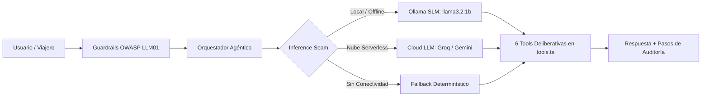
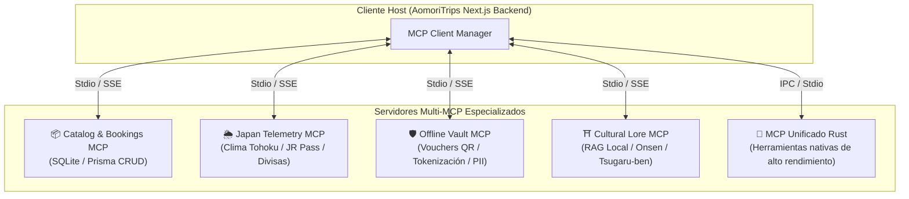

# Hoja de Ruta Técnica: IA Local (SLMs/RAG) y Arquitectura Multi-MCP

## AomoriTrips (青森トリップス) · Proyecto Final UTN.BA

> **Autor**: Federico Terradas  
> **Fecha de Actualización**: Septiembre 2026  
> **Rama de Desarrollo**: `feat/local-first-enhancements`  
> **Objetivo**: Documentar el estado actual de la inteligencia artificial del proyecto y definir la guía paso a paso para profundizar la ejecución **100% local (SLMs)** y el ecosistema **Multi-MCP (Model Context Protocol)** antes de la entrega final.

---

## 1. Diagnóstico del Estado Actual de la IA

La arquitectura de inteligencia artificial implementada en AomoriTrips resuelve con éxito la resiliencia en múltiples entornos (desarrollo local y nube serverless):



### Fortalezas Consolidadas

1. **Costura de Inferencia (_Inference Seam_)**: Conmutación transparente entre Ollama local, Cloud LLM (Groq / Gemini) y motor determinístico de contingencia (reglas expertas locales en ~10ms).
2. **Cero Caídas en Producción**: Si el servidor en Vercel no tiene acceso a Ollama local ni API keys, el agente nunca lanza un error HTTP 500.
3. **Guardrails de Ciberseguridad**: Detección activa de Prompt Injections (`ignore previous instructions`, `dan mode`, inyección HTML) y sanitización estricta.
4. **Auditoría Técnica en Vivo**: Panel de trazabilidad que expone latencias, herramientas invocadas y argumentos en la UI de _Sensei IA_.

---

## 2. Eje 1: Fortalecimiento de la IA Local (SLM / RAG Offline)

El objetivo de este eje es **maximizar la calidad del razonamiento local**, reduciendo la dependencia de APIs en la nube y garantizando privacidad total y funcionamiento 100% desconectado.

### 2.1. Matriz de Modelos SLM Recomendados para Ollama

| Modelo                        | Parámetros | VRAM Requerida  | Cuantización | Caso de Uso en AomoriTrips                                                                    |
| :---------------------------- | :--------: | :-------------: | :----------: | :-------------------------------------------------------------------------------------------- |
| `llama3.2:1b` _(Actual)_      |    1.2B    |     ~1.3 GB     |    Q4_K_M    | Chat rápido en laptops con recursos limitados.                                                |
| `llama3.2:3b` _(Recomendado)_ |    3.2B    |     ~2.6 GB     |    Q4_K_M    | **Óptimo**: Gran mejora en comprensión de español y llamada a tools estructuradas.            |
| `qwen2.5:3b` / `qwen2.5:7b`   | 3B / 7.6B  | ~2.5 GB / ~5 GB |    Q4_K_M    | **Sobresaliente**: Excelente en manejo bilingüe (Español/Japonés) y generación JSON estricta. |
| `deepseek-r1:1.5b`            |    1.5B    |     ~1.6 GB     |    Q4_K_M    | Razonamiento reflexivo con cadena de pensamiento (_Chain-of-Thought_) local.                  |

### 2.2. Modelfile Nativo para Aomori Sensei (`Modelfile.sensei`)

En lugar de inyectar el system prompt completo en cada llamada HTTP, se propone empaquetar un modelo local dedicado en Ollama:

```dockerfile
# Modelfile para Aomori Sensei Local
FROM llama3.2:3b

# Temperatura equilibrada para asistencia turística precisa
PARAMETER temperature 0.3
PARAMETER top_p 0.9
PARAMETER stop "<|eot_id|>"
PARAMETER stop "<|end_of_text|>"

# System Prompt congelado en el modelo local
SYSTEM """
Eres Aomori Sensei (青森の先生), guía cultural y asesor turístico experto en la prefectura de Aomori y la región de Tohoku (Japón).
- Respondes siempre en español con tono cálido, respetuoso y culturalmente auténtico.
- Tu misión es guiar en expediciones secretas (Hirosaki, Nebuta, Hakkoda, Osorezan, Shirakami-Sanchi).
- Utilizas siempre datos estructurados y desgloses de precios sin cargos ocultos.
- Conoces a fondo el tren Shinkansen Hayabusa, los baños termales (Hitō) y la gastronomía Kaiseki.
"""
```

_Comando para compilarlo localmente:_

```powershell
ollama create aomori-sensei:3b -f ./Modelfile.sensei
```

### 2.3. Tool Calling Estructurado con Esquemas Zod en Ollama

Actualmente las tools se invocan por heurística y reglas semánticas. Ollama v0.3+ soporta el parámetro `format: json` forzando esquemas JSON estrictos:

```typescript
// Próxima implementación en local-slm.ts
const response = await fetch(`${this.baseUrl}/api/chat`, {
  method: "POST",
  headers: { "Content-Type": "application/json" },
  body: JSON.stringify({
    model: "aomori-sensei:3b",
    messages: formattedMessages,
    stream: false,
    format: "json", // Fuerza salida JSON válida verificable por Zod
    options: { temperature: 0.2 },
  }),
});
```

### 2.4. Local RAG con Base Vectorial Liviana en SQLite

Para evitar alucinaciones en datos históricos, santuarios y normas de etiqueta en Ryokans:

1. **Modelo de Embeddings Local**: `nomic-embed-text` (274 MB) o `bge-small-en-v1.5` corriendo en Ollama.
2. **Almacenamiento**: Tablas en SQLite con soporte para similitud de cosenos (`sqlite-vec` o vector store ligero in-memory).
3. **Dataset Documental**: Fichas markdown de los 6 paquetes, horarios de mareas, festividades locales y reglas de etiqueta en baños Onsen.

---

## 3. Eje 2: Arquitectura Multi-MCP (Model Context Protocol)

El protocolo abierto **Model Context Protocol (MCP)** desarrollado por Anthropic permite desacoplar la inteligencia del modelo de las fuentes de datos y herramientas del sistema operativo.

### 3.1. Visión Arquitectónica: De Tools Monolíticas a Ecosistema Multi-MCP



### 3.2. Catálogo de Servidores MCP Propuestos

#### Servidor 1: `aomori-catalog-mcp`

- **Responsabilidad**: Exponer paquetes turísticos, disponibilidad estacional, cálculos presupuestarios y persistencia de reservas.
- **Herramientas**:
  - `search_packs(season, max_budget, query)`
  - `calculate_pricing(base_price, travelers, season)`
  - `create_booking(pack_id, user_id, travelers)`
- **Recursos (Resources)**:
  - `pack://{id}`: Ficha técnica en JSON con itinerario completo.
  - `catalog://schema`: Definición del modelo relacional de la base de datos.

#### Servidor 2: `japan-telemetry-mcp`

- **Responsabilidad**: Consultar datos del mundo real de Japón.
- **Herramientas**:
  - `get_tohoku_weather(region_code, date)`: Temperaturas reales y pronóstico de nevadas en Hakkoda.
  - `get_shinkansen_status()`: Estado de la línea Tohoku Shinkansen (Shin-Aomori a Tokio).
  - `get_jpy_exchange_rate()`: Cotización en tiempo real USD/JPY.

#### Servidor 3: `offline-vault-mcp` (Seguridad y Privacidad)

- **Responsabilidad**: Manejo seguro de datos sensibles conforme a PCI-DSS y PII.
- **Herramientas**:
  - `generate_offline_voucher(booking_code, pack_data)`: Generación de PNG con código QR cifrado.
  - `tokenize_payment_card(card_number, exp_date)`: Algoritmo de Luhn + Bóveda tokenizada.
  - `mask_passport_data(passport_number)`: Enmascaramiento de identidad para cumplimiento de privacidad.

#### Servidor 4: `cultural-lore-mcp`

- **Responsabilidad**: Base de conocimiento cultural y lingüístico de la región de Tsugaru.
- **Herramientas**:
  - `explain_onsen_etiquette(tattoo_policy, bath_rules)`
  - `translate_tsugaru_dialect(phrase)`: Explicación de modismos locales de Aomori.
  - `get_festival_history(matsuri_name)`: Historia de los maestros artesanos Nebuta-shi.

#### Servidor 5: `mcp-unificado-rust` (Herramientas de Sistema)

- **Responsabilidad**: Ejecución de micro-servicios compilados en Rust con latencias sub-milisegundo para procesamiento de datos en lote o verificación criptográfica pesada.

### 3.3. Implementación del Cliente Multi-MCP en TypeScript

Se utilizará el paquete oficial `@modelcontextprotocol/sdk`:

```typescript
// src/lib/mcp/client-hub.ts
import { Client } from "@modelcontextprotocol/sdk/client/index.js";
import { StdioClientTransport } from "@modelcontextprotocol/sdk/client/stdio.js";

export class MultiMCPHub {
  private clients: Map<string, Client> = new Map();

  async registerServer(name: string, command: string, args: string[]) {
    const transport = new StdioClientTransport({ command, args });
    const client = new Client(
      { name: `aomori-${name}`, version: "1.0.0" },
      { capabilities: {} }
    );
    await client.connect(transport);
    this.clients.set(name, client);
  }

  async getAllTools() {
    const allTools = [];
    for (const [serverName, client] of this.clients.entries()) {
      const { tools } = await client.listTools();
      allTools.push(...tools.map((t) => ({ ...t, server: serverName })));
    }
    return allTools;
  }
}
```

---

## 4. Eje 3: Módulo de Experiencias Visuales & Blogs Culturales (Nueva Feature)

Para transformar a AomoriTrips de una plataforma puramente transaccional a un portal de descubrimiento inmersivo para soñadores y planificadores (Capa 1 y Capa 2 de la visión de dominio), se proyecta el **Módulo de Galería Turística y Bitácora de Viajes**:

### 4.1. Galería de Fotografía Turística en Alta Definición (`/galeria`)

- **Propósito**: Exhibir la riqueza escénica y cultural de las 4 estaciones de Aomori, superando el cliché de Tokio y Kioto.
- **Zonas y Categorías Curadas**:
  - _🌸 Sakura en Hirosaki_: Foso de pétalos rosados (_Hanaikada_), Castillo feudal iluminado de noche y puentes tradicionales.
  - _🏮 Nebuta Matsuri_: Carrozas de papel Washi iluminadas con fuego por los artesanos _Nebuta-shi_, bailarines _Haneto_ y desfiles.
  - _🍁 Garganta de Oirase & Lago Towada_: Torrentes de agua cristalina entre hojas doradas y rojas de otoño (_Koyo_), senderos musgosos.
  - _❄️ Nieve Profunda en Hakkoda & Sukayu Onsen_: Los "Monstruos de Nieve" (_Juhyo_), baños termales humeantes en madera de ciprés _Hiba_.
  - _🌳 Bosque Primario de Shirakami-Sanchi_: Patrimonio Mundial de la UNESCO, lagos de zafiro de Juniko (_Aoike_).
- **Componentes Técnicos Previstos**:
  - `GalleryGrid.tsx`: Malla responsiva con carga diferida progresiva (_Blur-up / Next.js Image Optimization_).
  - `PhotoLightboxModal.tsx`: Visor a pantalla completa con metadatos fotográficos (ubicación exacta en mapa, mejor época del año, paquete turístico vinculado para cotizar en un clic).
  - Integración con los personajes de la plataforma (`Sakura` y `Haruto`) como curadores visuales de las fotos.

### 4.2. Sistema de Bitácora y Blogs de Viajeros (`/blog`)

- **Propósito**: Generar contenido editorial no transaccional que nutra de contexto a los viajeros y sirva de base documental para el Agente IA (RAG).
- **Líneas Editoriales**:
  1. _Guías de Etiqueta Japonesa_: "Cómo bañarse en un Onsen tradicional sin cometer errores culturales (política de tatuajes y protocolo de toallas)".
  2. _Gastronomía de Tohoku_: "Ruta de la Manzana de Aomori y el cuenco de mariscos Nokkedon en el Mercado de Furukawa".
  3. _Crónicas de Artesanos_: "Entrevista a un maestro artesano Nebuta-shi: 12 meses para construir una carroza de fuego".
  4. _Logística del Viajero_: "Cómo usar el JR East Tohoku Pass en el Shinkansen Hayabusa desde Tokio a Shin-Aomori".
- **Arquitectura de Implementación**:
  - Markdown / MDX estático en `content/blog/*.mdx` o tabla relacional `BlogPost` en Prisma.
  - Renderizado Server-Side con `generateStaticParams` para latencia ultrabaja y SEO impecable.
  - Cada artículo incluye un bloque interactivo con _Aomori Sensei_ para hacer preguntas específicas sobre el tema del post.

---

## 5. Guía de Revisión Personal: Sección 7 y Parte 2 del Informe

En estas secciones el docente evaluará tu **criterio personal, sentido crítico y voz propia como desarrollador**. A continuación se detallan los puntos clave redactados en el informe para que los leas, valides y, si querés, los complementes o reescribas con tu propia experiencia:

### 5.1. Sección 7 · Co-working con Inteligencia Artificial

- **Tabla de Herramientas (7.1)**:
  - Se listaron: _Claude_ (orquestador agéntico y guardrails), _Gemini_ (frontend, esquemas Prisma, informe), _Cursor/Copilot_ (autocompletado y tests), _Archify_ (diagramas de arquitectura), _Codebase Design de Matt Pocock_ (Deep Modules y Seams) y _Leonardo.ai/Figma_ (paleta visual).
  - _Qué revisar_: ¿Sentís que alguna de estas herramientas la usaste más o menos? Podés ajustar los comentarios de la columna _"Aportó bien / mal / sorprendió"_.
- **Bitácora de Co-working Crítico (7.2 — Fallas de la IA corregidas por vos)**:
  - **Falla 1**: El botón de favoritos volátil (`useState` efímero que perdía los datos al recargar) corregido con persistencia en `localStorage`.
  - **Falla 2**: Tarjetas de catálogo gigantes (>550px) que saturaban la pantalla, corregidas compactándolas a 300px y agregando acordeón sutil.
  - **Falla 3**: Omisión total de la pantalla de Perfil de Figma, corregida creando `ProfileView.tsx` con métodos de pago, selector de moneda e idioma.
  - _Qué revisar_: Leé estos 3 casos; están muy sólidos y muestran que no aceptaste ciegamente lo que tiraba la IA, sino que pusiste criterio de producto.
- **Reflexión Crítica Obligatoria (7.3)**:
  - Balance entre la tremenda velocidad de desarrollo aportada por la IA y la necesidad ineludible de supervisión humana rigurosa.
  - _Qué revisar_: Podés agregar una oración con tus propias palabras sobre tu experiencia personal durante las semanas del curso.

### 5.2. Parte 2 · IA Local en tu Proyecto (Las 4 Preguntas Clave)

- **Pregunta 1: ¿Qué papel jugaría un LLM/SLM local en tu proyecto?**
  - _Respuesta_: No reemplaza al modelo cloud de 70B en la web, sino que actúa como subagente de contingencia offline y de privacidad en destino (zonas montañosas de Aomori sin señal).
- **Pregunta 2: ¿Qué le aportaría al usuario de la aplicación?**
  - _Respuesta_: Resiliencia 100% offline (sin plan de datos internacional), privacidad absoluta de datos sensibles (pasaporte, salud, tarjetas) y cero latencia.
- **Pregunta 3: ¿Qué te aportaría a vos como profesional?**
  - _Respuesta_: Capacidad de auditar datos sin fugas a terceros, autonomía para desarrollar sin internet ni gastar créditos de API, y dominio de la pila completa de IA (cuantización GGUF, VRAM, SLMs).
- **Pregunta 4: ¿Qué limitaciones concretas tiene versus una API en la nube?**
  - _Respuesta_: Requerimientos de hardware local (RAM/VRAM), menor fiabilidad en razonamiento complejo y Function Calling estructurado (JSON de tools), y mayor dificultad para actualizar el conocimiento sin reentrenar o hacer RAG local.
- **Entregable Opcional (Captura de Ollama)**:
  - Hay transcripta una consulta sobre qué visitar en invierno en Aomori (Sukayu Onsen, Castillo de Hirosaki, Lago Towada). Cuando saques la captura real de la terminal de PowerShell, se reemplaza la imagen allí.

---

## 6. Checklist de Tareas Inmediatas para la Entrega Final

- [ ] **Captura 1 (Frontend)**: Pantalla Home / Catálogo con filtros estacionales en `http://localhost:3000`.
- [ ] **Captura 2 (Frontend)**: Chat interactivo con _Aomori Sensei_ respondiendo y recomendando paquetes.
- [ ] **Captura 3 (Frontend)**: Pantalla de Billetera con el código QR y la reserva confirmada (`AOM-2026`).
- [ ] **Captura 4 (Terminal)**: Ventana de PowerShell ejecutando `ollama run llama3.2:1b` (para Parte 2).
- [ ] **Video de Demostración (3 a 4 min)**:
  - Recorrido: Home → Chat con Sensei → Reserva con QR en Billetera → Terminal con 40 tests pasando y Ollama.
  - Subir a YouTube (No listado), Loom o Drive y pegar link en la tabla del informe y Sección 4.2.
- [ ] **Configurar Secreto Criptográfico**:
  - Definir `VOUCHER_HMAC_SECRET="clave_segura_32_caracteres"` en `.env.local` y en las variables de entorno de Vercel.
- [ ] **Deploy y Verificación en Vercel**:
  - Verificar que `https://aomoritrips.vercel.app` compile sin errores y responda.
- [ ] **Exportación Final a PDF**:
  - Abrir `docs/informe_entrega_final_aomoritrips.md` en VS Code y exportar a PDF para subir al Campus de UTN.BA.

---

## 7. Justificación Académica para la Rúbrica de UTN.BA

Esta evolución de arquitectura cumple directamente con los criterios de excelencia del curso:

1. **Soberanía de Datos e Inteligencia Offline**: Cumple con el paradigma _Local-First_ y preserva la privacidad del viajero sin enviar datos a terceros.
2. **Interoperabilidad mediante Estándares Abiertos**: La adopción de **Model Context Protocol (MCP)** coloca el proyecto en la frontera técnica de la industria de software agéntico contemporánea (2026).
3. **Robustez y Tolerancia a Fallos**: La costura de inferencia (_inference seam_) asegura que la aplicación sea presentable tanto en una demo local como en un entorno de producción público en Vercel.
4. **Defensa en Profundidad y Cumplimiento**: Eliminación de vulnerabilidades de falsificación de comprobantes mediante HMAC-SHA256 y blindaje contra DoS con Rate Limiting perimetral.

```

```
